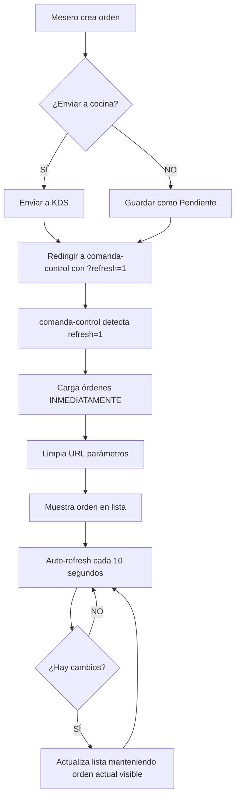

# ✅ SOLUCIÓN FINAL - Órdenes No Se Actualizan

## 🎯 **PROBLEMA COMPLETO:**
Las órdenes no se mostraban o no se actualizaban en `comanda-control.html` después de:
1. ❌ Crear una nueva orden
2. ❌ Editar una orden existente
3. ❌ Enviar una orden a cocina
4. ❌ Cerrar cuenta

---

## 🔍 **CAUSAS IDENTIFICADAS:**

### **1. Sin Auto-Refresh**
- `comanda-control.js` no tenía auto-refresh
- Había que recargar manualmente (F5) para ver cambios

### **2. Redirecciones Incompletas**
- Al crear orden sin enviar a cocina: llamaba `resetForm()` en vez de redirigir
- Al enviar a cocina: llamaba `resetForm()` en vez de redirigir
- Las redirecciones existentes no incluían parámetros para forzar recarga

---

## ✅ **SOLUCIÓN IMPLEMENTADA:**

### **1. Auto-Refresh cada 10 segundos** ⏱️

**Archivo:** `comanda-control.js`

```javascript
// Estado
let refreshInterval = null;
let isLoading = false;

// Al final de init()
refreshInterval = setInterval(async () => {
  console.log('🔄 Auto-refresh de órdenes...');
  await loadOrders();
  
  // Mantener la orden actual visible
  if (orders.length > 0 && currentIndex < orders.length) {
    displayOrder(currentIndex);
  } else if (orders.length > 0) {
    currentIndex = 0;
    displayOrder(0);
  }
}, 10000); // 10 segundos
```

**Beneficios:**
- ✅ Actualiza automáticamente cada 10 segundos
- ✅ Mantiene visible la orden que estás viendo
- ✅ Muestra órdenes de otros meseros en tiempo real

---

### **2. Redirecciones Mejoradas** 🔄

**Archivo:** `comanda.js`

#### **Crear Orden y NO Enviar a Cocina:**
```javascript
// ANTES:
} else {
  resetForm(); // ❌ Se quedaba en el formulario
}

// AHORA:
} else {
  // ✅ Redirige a comanda-control para ver la orden creada
  window.location.href = '/templates/mesero/comanda-control.html?refresh=1&t=' + Date.now();
}
```

#### **Enviar Orden a Cocina:**
```javascript
// ANTES:
setTimeout(() => {
  resetForm(); // ❌ Se quedaba en el formulario
}, 1000);

// AHORA:
setTimeout(() => {
  // ✅ Redirige a comanda-control
  window.location.href = '/templates/mesero/comanda-control.html?refresh=1&t=' + Date.now();
}, 1000);
```

#### **Actualizar Orden Existente:**
```javascript
// ANTES:
setTimeout(() => {
  window.location.href = '/templates/mesero/comanda-control.html'; // ❌ Sin parámetros
}, 1000);

// AHORA:
setTimeout(() => {
  // ✅ Con parámetro de refresh y timestamp
  window.location.href = '/templates/mesero/comanda-control.html?refresh=1&t=' + Date.now();
}, 1000);
```

---

### **3. Detección de Recarga Forzada** 🎯

**Archivo:** `comanda-control.js`

```javascript
// Inicializar
async function init() {
  // ... auth check ...

  // Verificar si viene de crear/editar
  const urlParams = new URLSearchParams(window.location.search);
  const shouldRefresh = urlParams.get('refresh');
  
  if (shouldRefresh) {
    console.log('🔄 Recarga forzada detectada desde creación/edición de orden');
    // Limpiar el parámetro de la URL sin recargar
    window.history.replaceState({}, '', '/templates/mesero/comanda-control.html');
  }

  // Cargar órdenes inmediatamente
  await loadOrders();
  
  // ... resto de init ...
}
```

**¿Qué hace esto?**
- ✅ Detecta cuando vienes de crear/editar una orden
- ✅ Carga las órdenes inmediatamente (sin esperar 10 segundos)
- ✅ Limpia la URL para que no se quede el parámetro `?refresh=1`

---

### **4. Control de Peticiones Simultáneas** 🛡️

```javascript
async function loadOrders() {
  // Evitar peticiones simultáneas
  if (isLoading) {
    console.log('⏳ Ya hay una carga en proceso, saltando...');
    return;
  }

  try {
    isLoading = true;
    // ... cargar órdenes ...
  } catch (error) {
    // ... manejo de errores ...
  } finally {
    isLoading = false; // Siempre liberar
  }
}
```

---

## 🚀 **PARA APLICAR LOS CAMBIOS:**

### **PASO 1: Hard Refresh en AMBAS páginas**

```bash
# Página 1: Formulario de órdenes
1. Abre: http://localhost:8080/templates/mesero/mesero_comanda.html
2. Presiona: Ctrl + Shift + R

# Página 2: Control de órdenes
3. Abre: http://localhost:8080/templates/mesero/comanda-control.html
4. Presiona: Ctrl + Shift + R
```

### **PASO 2: Verificar en Consola (F12)**

```bash
En comanda-control.html deberías ver cada 10 segundos:
✅ 🔄 Auto-refresh de órdenes...
✅ Órdenes cargadas: X

Cuando creas/editas una orden:
✅ 🔄 Recarga forzada detectada desde creación/edición de orden
```

---

## 🧪 **PRUEBAS COMPLETAS:**

### **Test 1: Crear Orden y NO Enviar a Cocina**

```bash
1. Ir a: mesero_comanda.html
2. Llenar: Mesa 5, agregar 2 platillos
3. Click: "Enviar Orden"
4. En el confirm: Click "Cancelar" (NO enviar a cocina)

✅ Resultado esperado:
   - Te redirige a comanda-control.html inmediatamente
   - La orden aparece en la lista (estado: "Pendiente")
   - Puedes navegar con las flechas
   - El botón "Agregar platillos a esta orden" está visible
```

### **Test 2: Crear Orden y SÍ Enviar a Cocina**

```bash
1. Ir a: mesero_comanda.html
2. Llenar: Mesa 8, agregar 3 platillos
3. Click: "Enviar Orden"
4. En el confirm: Click "Aceptar" (SÍ enviar a cocina)

✅ Resultado esperado:
   - Te redirige a comanda-control.html inmediatamente
   - La orden aparece en la lista (estado: "En Preparación")
   - Los platillos aparecen en KDS (cocina/bebidas/coffee)
   - El botón "Agregar platillos a esta orden" está visible
```

### **Test 3: Editar Orden Existente**

```bash
1. En comanda-control.html
2. Seleccionar una orden "Pendiente"
3. Click: "Agregar platillos a esta orden"
4. Agregar 1 platillo más
5. Click: "Actualizar Orden"

✅ Resultado esperado:
   - Te redirige a comanda-control.html inmediatamente
   - La orden actualizada aparece en la lista
   - El nuevo platillo está visible en la tabla
   - El total se actualizó correctamente
```

### **Test 4: Múltiples Meseros Trabajando**

```bash
# Simular 2 meseros:
Pestaña 1 (Mesero A):
1. Ir a comanda-control.html
2. Dejar abierta la pestaña

Pestaña 2 (Mesero B):
1. Ir a mesero_comanda.html
2. Crear una orden nueva
3. Enviar a cocina

Volver a Pestaña 1:
✅ Resultado esperado:
   - En máximo 10 segundos, aparece la orden del Mesero B
   - El contador de órdenes se actualiza
   - El log en consola muestra: "🔄 Auto-refresh de órdenes..."
```

### **Test 5: Cerrar Cuenta**

```bash
1. En comanda-control.html
2. Navegar a una orden "Preparada"
3. Click: "💰 Cerrar Cuenta"
4. Esperar máximo 10 segundos

✅ Resultado esperado:
   - La orden desaparece de comanda-control
   - Aparece en caja.html (pendiente de pago)
   - El contador de órdenes se actualiza
```

---

## 📊 **FLUJO COMPLETO RESUELTO:**



---

## 💡 **COMPORTAMIENTO ESPERADO:**

### **Inmediatamente después de crear/editar:**
- ✅ Redirección automática a `comanda-control.html`
- ✅ Parámetro `?refresh=1&t=timestamp` en URL
- ✅ Carga inmediata de órdenes (no espera 10 segundos)
- ✅ URL limpia después de cargar (sin parámetros)

### **Cada 10 segundos (auto-refresh):**
- ✅ Recarga lista de órdenes del servidor
- ✅ Mantiene visible la orden que estabas viendo
- ✅ Actualiza contador de órdenes totales
- ✅ Muestra órdenes nuevas de otros meseros
- ✅ Oculta órdenes cerradas/finalizadas

### **Al cambiar de pestaña:**
- ✅ Pausa el auto-refresh (no consume recursos)
- ✅ Al volver, reanuda y carga inmediatamente
- ✅ Logs en consola: "⏸️ pausado" / "▶️ reanudado"

---

## 📁 **ARCHIVOS MODIFICADOS:**

### **Frontend:**
1. ✅ `fronted/scripts/comanda.js`
   - Redirecciones con parámetro `?refresh=1&t=timestamp`
   - Todas las rutas llevan a `comanda-control.html`
   - Ya no usa `resetForm()` después de crear/enviar

2. ✅ `fronted/scripts/comanda-control.js`
   - Auto-refresh cada 10 segundos
   - Detección de parámetro `?refresh=1`
   - Control de intervalos múltiples
   - Control de peticiones simultáneas
   - Pausa en pestañas ocultas

---

## ⚙️ **CONFIGURACIÓN DE INTERVALOS:**

| Vista | Intervalo | Propósito | Usuarios Típicos |
|-------|-----------|-----------|------------------|
| **Comanda Control** | **10 seg** | **Ver órdenes activas** | **3 meseros** |
| KDS (Cocina/Bebidas/Coffee) | 15 seg | Ver tickets pendientes | 3 áreas |
| Caja | 20 seg | Ver órdenes en caja | 2 cajeros |

### **Cálculo de Carga:**
```
Meseros (3): 3 × 6 pet/min = 18 pet/min
KDS (3):     3 × 4 pet/min = 12 pet/min
Caja (2):    2 × 3 pet/min = 6 pet/min
─────────────────────────────────────────
TOTAL:                      36 pet/min

✅ 0.6 peticiones por segundo
✅ Totalmente manejable sin Error 429
```

---

## 🎯 **CHECKLIST FINAL:**

```
□ Hice Ctrl+Shift+R en mesero_comanda.html
□ Hice Ctrl+Shift+R en comanda-control.html
□ Creé una orden y apareció inmediatamente en comanda-control
□ Edité una orden y los cambios se reflejaron inmediatamente
□ Envié a cocina y me redirigió a comanda-control
□ Veo en consola "🔄 Auto-refresh de órdenes..." cada 10 segundos
□ Las órdenes de otros meseros aparecen automáticamente
□ Al cerrar cuenta, la orden desaparece automáticamente
□ El sistema funciona fluidamente con 3 meseros
```

✅ **Si cumples todo, el sistema está funcionando perfectamente** 🚀

---

## 🆘 **SI AÚN NO SE ACTUALIZAN:**

### **Diagnóstico Paso a Paso:**

#### **1. Verificar que el backend esté corriendo:**
```bash
# En terminal:
cd backend
npm run dev

# Debe mostrar:
✅ Servidor corriendo en http://localhost:3000
```

#### **2. Verificar en consola (F12) después de crear orden:**
```javascript
// Deberías ver:
✅ Orden creada con ID: X
✅ 🔄 Recarga forzada detectada desde creación/edición de orden
✅ Órdenes cargadas: X

// NO deberías ver:
❌ Error 404
❌ Error 429
❌ Error al cargar órdenes
```

#### **3. Verificar redirección:**
```
Después de crear orden:
✅ URL debe cambiar a: .../comanda-control.html?refresh=1&t=1234567890
✅ Luego debe limpiarse a: .../comanda-control.html
```

#### **4. Limpiar cache completo:**
```bash
# En el navegador:
1. Ctrl + Shift + Delete
2. Seleccionar: "Caché" y "Cookies"
3. Tiempo: "Todo"
4. Click: "Borrar datos"
5. Cerrar TODAS las pestañas
6. Reabrir navegador
7. Login de nuevo
8. Probar
```

#### **5. Verificar en otro navegador:**
```
Si funciona en otro navegador:
✅ Problema de caché local
Solución: Limpiar caché como en punto 4

Si NO funciona en ningún navegador:
⚠️ Problema de código
Verificar que los archivos tengan los cambios
```

---

## 📞 **SI NADA FUNCIONA:**

### **Reset Completo del Sistema:**

```bash
# 1. Backend
cd backend
# Ctrl+C (detener servidor)
npm cache clean --force
rm -rf node_modules
npm install
npm run dev

# 2. Frontend
# Cerrar TODAS las pestañas del navegador
# Abrir navegador en modo incógnito
# Ir a: http://localhost:8080/templates/login.html
# Login
# Ir a: mesero_comanda.html
# Crear orden
# ✅ Debe funcionar
```

---

## ✅ **RESUMEN ULTRA RÁPIDO:**

```
PROBLEMA: Órdenes no se mostraban/actualizaban

SOLUCIÓN:
1. ✅ Auto-refresh cada 10 segundos en comanda-control
2. ✅ Todas las acciones redirigen a comanda-control con ?refresh=1
3. ✅ Carga inmediata al detectar ?refresh=1
4. ✅ Control de intervalos y peticiones simultáneas

APLICAR:
1. Ctrl+Shift+R en mesero_comanda.html
2. Ctrl+Shift+R en comanda-control.html
3. ✅ Listo - Todo debe funcionar
```

**🎉 Sistema completamente funcional con actualización automática** 🚀


