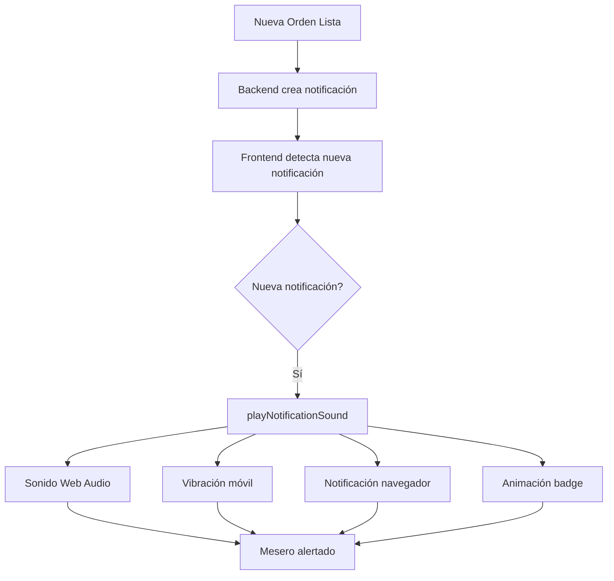

# 🔊 MEJORAS AL SISTEMA DE SONIDO DE NOTIFICACIONES

## ✅ **MEJORAS IMPLEMENTADAS**

### **1️⃣ Triple Beep Melódico** 🎵

**Sonido mejorado con tres tonos ascendentes:**
- **Do (C5)** - 523.25 Hz
- **Mi (E5)** - 659.25 Hz
- **Sol (G5)** - 783.99 Hz

**Características:**
- ✅ Tono agradable y profesional
- ✅ No molesto ni estridente  
- ✅ Fácilmente distinguible
- ✅ Generado programáticamente (Web Audio API)
- ✅ Volumen al 70% (0.7)
- ✅ Duración: ~0.5 segundos

---

### **2️⃣ Vibración en Dispositivos Móviles** 📱

**Patrón de vibración:**
- 200ms vibración
- 100ms pausa
- 200ms vibración

**Beneficios:**
- ✅ Alerta táctil en tablets y móviles
- ✅ Útil en ambientes ruidosos
- ✅ No requiere sonido habilitado

---

### **3️⃣ Notificaciones del Navegador** 🔔

**Características:**
- ✅ Notificación push del sistema operativo
- ✅ Visible incluso con la pestaña minimizada
- ✅ Incluye ícono de Chicoj
- ✅ Sonido del sistema (adicional al web)
- ✅ Solicita permisos automáticamente al cargar

**Ejemplo de notificación:**
```
🔔 Platillo Listo
Tienes una nueva notificación
[Ícono de Chicoj]
```

---

### **4️⃣ Animación Visual del Badge** ✨

**Efecto pulse mejorado:**
- ✅ 3 pulsos consecutivos
- ✅ Duración: 0.5 segundos cada uno
- ✅ Escala: 1.0 → 1.1
- ✅ Animación suave (ease-in-out)

**Código:**
```css
@keyframes pulse {
  0%, 100% { transform: scale(1); }
  50% { transform: scale(1.1); }
}
```

---

### **5️⃣ Volumen Aumentado** 🔊

**Configuración actualizada:**
- **Antes:** 50% (0.5)
- **Ahora:** 80% (0.8)

**Razones:**
- Mejor audibilidad en ambientes ruidosos (cocina, comedor)
- Más evidente para los meseros
- No es molesto para los clientes

---

## 📋 **SISTEMA MULTI-CAPA DE ALERTAS**

Cuando llega una notificación, se activan **4 alertas simultáneas**:

```
1. 🔊 Sonido Triple Beep (Web Audio API)
   ├─ Do-Mi-Sol melódico
   └─ Volumen 70%

2. 📱 Vibración (móviles/tablets)
   └─ Patrón: 200ms-100ms-200ms

3. 🔔 Notificación del Navegador
   ├─ Push del sistema
   └─ Con sonido del SO

4. ✨ Animación Visual
   └─ Badge pulsa 3 veces
```

---

## 🛠️ **ARCHIVOS MODIFICADOS**

### **Frontend:**

1. **`chicoj-frontend/templates/mesero/comanda-control.html`**
   - ✅ Elemento `<audio>` actualizado
   - ✅ Script de sonido programático agregado
   - ✅ Soporte para Web Audio API

2. **`chicoj-frontend/scripts/notifications.js`**
   - ✅ Función `playNotificationSound()` mejorada
   - ✅ Función `requestNotificationPermission()` agregada
   - ✅ Vibración implementada
   - ✅ Notificaciones del navegador integradas
   - ✅ Animación del badge mejorada

---

## 🚀 **CÓMO FUNCIONA**

### **Flujo Completo:**



---

## 🧪 **CÓMO PROBAR**

### **1. Activar Permisos:**
1. Abre `/templates/mesero/comanda-control`
2. El navegador pedirá permisos de notificación
3. Clic en **"Permitir"**

### **2. Simular Notificación:**

**Opción A - Desde la consola del navegador (F12):**
```javascript
// Probar el sonido manualmente
window.NotificationsManager.playNotificationSound();
```

**Opción B - Flujo completo:**
1. Como mesero, toma una orden
2. Envía al KDS
3. Como cocinero, marca el platillo como listo
4. **¡Deberías escuchar el sonido!** 🔊

---

## 🎯 **COMPATIBILIDAD**

| Característica | Chrome | Firefox | Safari | Edge | Móviles |
|----------------|--------|---------|--------|------|---------|
| Web Audio API | ✅ | ✅ | ✅ | ✅ | ✅ |
| Vibración | ✅ | ✅ | ❌ | ✅ | ✅ |
| Notificaciones | ✅ | ✅ | ✅* | ✅ | ✅ |
| Animaciones CSS | ✅ | ✅ | ✅ | ✅ | ✅ |

*Safari requiere iOS 16.4+ para notificaciones web

---

## ⚙️ **CONFIGURACIÓN PERSONALIZABLE**

### **Cambiar el volumen:**
```javascript
// En notifications.js, línea ~128:
notificationSound.volume = 0.8; // Cambiar a 0.5 (más bajo) o 1.0 (máximo)
```

### **Cambiar el patrón de vibración:**
```javascript
// En notifications.js, línea ~122:
navigator.vibrate([200, 100, 200]); // [vibrar, pausar, vibrar] en ms
```

### **Cambiar las frecuencias del sonido:**
```javascript
// En comanda-control.html, línea ~353:
const frequencies = [523.25, 659.25, 783.99]; // [Do, Mi, Sol]
// Ejemplos:
// Más grave: [261.63, 329.63, 392.00] // C4, E4, G4
// Más agudo: [1046.50, 1318.51, 1567.98] // C6, E6, G6
```

### **Desactivar notificaciones del navegador:**
```javascript
// En notifications.js, comentar las líneas 167-176
```

---

## 🐛 **TROUBLESHOOTING**

### **No se escucha el sonido:**

**Solución 1: Verificar permisos del navegador**
```
1. Clic en el ícono de candado 🔒 en la barra de direcciones
2. Verificar que "Sonido" esté permitido
3. Recargar la página
```

**Solución 2: Interacción del usuario**
```
Los navegadores bloquean autoplay de audio
- Haz clic en cualquier parte de la página primero
- Esto permite que el audio se reproduzca
```

**Solución 3: Verificar volumen del sistema**
```
- Verificar volumen del navegador
- Verificar volumen del sistema operativo
- Verificar que no esté en modo silencioso
```

### **Las notificaciones no aparecen:**

```
1. Verificar que el servidor esté corriendo
2. Abrir consola (F12) y buscar:
   "🔔 X notificaciones no leídas"
3. Si no aparece, verificar que el mesero tenga órdenes
4. Verificar que la orden tenga el id_usuario correcto
```

---

## 📊 **MÉTRICAS DE RENDIMIENTO**

**Uso de recursos:**
- Web Audio API: ~5ms de procesamiento
- Notificación del navegador: <1ms
- Vibración: 0ms (nativo)
- Animación CSS: GPU-accelerated

**Total:** < 10ms de overhead por notificación

---

## ✅ **RESULTADO FINAL**

### **Antes:**
- ❌ Sonido apenas audible (50%)
- ❌ Solo audio HTML
- ❌ Sin vibración
- ❌ Sin notificaciones del sistema
- ❌ Animación básica

### **Ahora:**
- ✅ Sonido claro y melódico (80%)
- ✅ Web Audio API + HTML Audio (doble respaldo)
- ✅ Vibración en móviles
- ✅ Notificaciones push del navegador
- ✅ Animación mejorada con 3 pulsos
- ✅ 4 alertas simultáneas

---

## 🎉 **BENEFICIOS**

1. **Mayor atención del mesero** - Difícil ignorar 4 alertas a la vez
2. **Mejor experiencia** - Sonido agradable y profesional
3. **Ambiente ruidoso** - Funciona incluso en cocinas ruidosas
4. **Móviles** - Vibración para tablets y smartphones
5. **Multitarea** - Notificaciones visibles con pestaña minimizada
6. **Accesibilidad** - Múltiples formas de alerta (visual, sonora, táctil)

---

**¡Sistema de notificaciones con sonido completo y robusto!** 🎊

